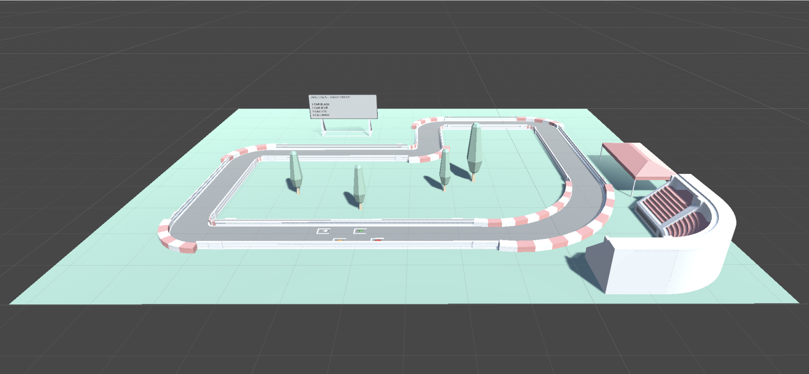
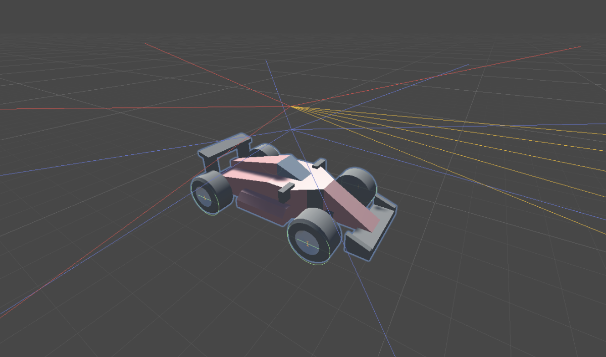

# Autonomous Driving Agent with Reinforcement Learning

This project, developed for the Intelligent Robotics (IR) course at the university, implements an autonomous driving agent using reinforcement learning (RL) techniques within Unity's ML-Agents framework. The goal is to train the agent to navigate a racing track using machine learning algorithms while avoiding collisions with walls or other agents.

## Project Overview

The agent is based on a modular racing kit model, which allows for experimentation with complex movement mechanics. The task is non-competitive, and the primary goal is for the agent to complete the track independently of other agents’ performances.

Key components of the project include:

- **Environment Setup**: A Unity-based track for training the agent to complete the course.
- **Agent Design**: A model incorporating control systems and sensor setups for collision avoidance and navigation.
- **Reinforcement Learning**: This involves using RL algorithms to train the agent, with a focus on Proximal Policy Optimization (PPO) and Soft Actor-Critic (SAC) methods.
- **Sensor Integration**: Raycasting sensors for collision detection, guiding the agent’s movements with feedback to improve performance.

## Key Features

### Sensors

The agent uses a set of raycasting sensors to detect obstacles, other agents, and checkpoints. These sensors provide observations critical for decision-making during training.

  

- **Red and Yellow Sensors**: Identify checkpoints to guide the agent’s direction.
- **Blue Sensor**: Detects walls and other agents in the environment.

### Reinforcement Learning
The agent learns via trial and error, improving its driving performance based on feedback (rewards) received after each action. The goal is to maximize the cumulative reward over time.

### Algorithms Used:
- **PPO (Proximal Policy Optimization)**: Used to train the agent by optimizing its policy based on actions that maximize rewards.
- **SAC (Soft Actor-Critic)**: An alternative RL algorithm compared with PPO, with a focus on handling continuous action spaces.

## Technical Details

### Unity & ML-Agents
The project leverages Unity and ML-Agents for simulating the environment and integrating machine learning models.

### Raycasting Sensors
The sensors use `RayPerceptionSensorComponent3D` to detect obstacles and track boundaries within the simulation. The agent collects multiple observations from different sensor directions.

### Neural Networks
The learning process is supported by deep neural networks that approximate the Q-function, or policy, guiding the agent’s decisions.

## Results & Evaluation

The two reinforcement learning algorithms (PPO and SAC) were compared based on performance metrics and generalization ability across different scenarios. The results are detailed in the corresponding sections of the project documentation.

## Further Information 

Feel free to fork the project, submit issues, or open pull requests with suggestions or improvements!
